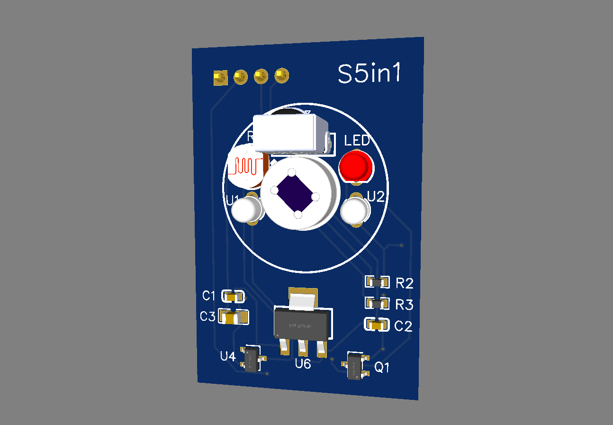
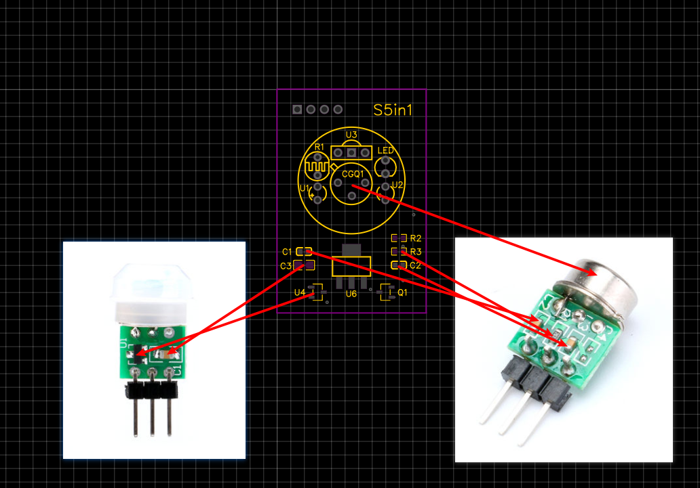

# S5in1

## 简介



玩智能家居有一段时间了，但是一直没接触传感器。逛[Hassbian论坛](https://bbs.hassbian.com)偶然接触到了**ESP**和[ESPHome](https://esphome.io)被惊喜到了，真的太好用了，如此多的传感器只需要简单配置就能接入`HA`。玩人体红外传感器时发现菲涅尔透镜下还有很多空间，突发奇想，为何不放进去更多和光有关的传感器，再把他们塞进常见的86型人体传感器里，这样既实用又美观。于是试着把人体红外传感器（检测是否有人）、红外发射传感器（遥控家电）、红外接收传感器（方便获取遥控器编码）、光敏电阻（获取亮度）、和`LED`灯（提示警告）。从淘宝买来了所有东西。试验了好几方案，最终还是选择了自己画原理图和`PCB`方案保证不会错和稳定，最终有了这个项目。本项目材料都是从淘宝购买, 型号及链接我会放在下方。

## 目录

* [硬件](#硬件)
    * [材料清单](#材料清单)
    * [PCB](#PCB)
    * [焊接](#焊接)
* [软件](#软件)
    * [ESPHome](#ESPHome)
    * [HASS](#HASS)
* [DIY](#DIY)
* [最后](#最后)

## `硬件`

### `材料清单`

该清单的数量是`DIY`一个`86`型`S5in1`所需要的，但实际购买时很多原件都是多个的价格没法单个买（比如电阻，二极管等），如果一次性`DIY`多个会更加划算，但实际只`DIY`一个的价格也不到`40RMB`（清单不包含焊接工具，刷机工具，等辅助工具价格），还是很便宜的

| 名称 | 型号 | 数量 | PCB标注 | 链接 |
| ----- | ----- | ----: | :----: | :----: |
| 3MM/F3 白发粉红 发光二极管 | 颜色很多 | 1 | LED | [购买](https://item.taobao.com/item.htm?id=544570466024) |
| 单排针 间距2.54MM | 1 * 40P| 1 | 5V GND RX TX | [购买](https://item.taobao.com/item.htm?id=553875848479) |
| VS/HX1838/PC638 红外接收头 || 1 | U3 | [购买](https://item.taobao.com/item.htm?id=522552967131) |
| 3MM 940nm红外发射管 || 2 | U1 / U2 | [购买](https://item.taobao.com/item.htm?id=522572541770) |
| 光敏电阻5516 | 5516 | 1 | R1 | [购买](https://item.taobao.com/item.htm?id=522556415238) |
| 微型人体红外感应模块 | AS312 | 1 | CGQ1 | [购买](https://item.taobao.com/item.htm?id=557748825353) |
| AMS1117-3.3 稳压电源芯片降压IC | AMS1117-3.3 | 1 | U6 | [购买](https://item.taobao.com/item.htm?id=522579028878) |
| ESP-12S模块 || 1 | ESP12S | [购买](https://item.taobao.com/item.htm?id=542762874623) |
| 贴片4 * 4 * 1.5/3.0MM 微动/按钮开关 | 4 * 4 * 1.5 | 1 | SW | [购买](https://item.taobao.com/item.htm?id=557115198331) |
| 贴片 S9014 J6/1F/T04/L6 100MA 三极管 SOT-23 || 1 | Q1 | [购买](https://item.taobao.com/item.htm?id=522573662856) |
| 0603贴片电阻 1MΩ 1兆欧 1/10W 精度±1% || 1 | R2 | [购买](https://item.taobao.com/item.htm?id=525898476191) |
| 315MHZ/433MHZ弹簧天线 | 信号不佳可买 | 1 | - | [购买](https://item.taobao.com/item.htm?id=606965691110) |
| 40P彩排杜邦线 | 母对母 21CM | 1 | - | [购买](https://item.taobao.com/item.htm?id=558182761958) |
| 220V转5V700mA电源模块 | 5V700mA | 1 | - | [购买](https://detail.tmall.com/item.htm?id=543443029399) |
| 86型人体感应开关面板 || 1 | - | [购买](https://detail.tmall.com/item.htm?id=622077644993) |

### `PCB`

自己是现学现用的`PCB`设计，尝试过`AD`但太复杂了，这种简单的模块就用国产`立创EDA`了，非常方便，设计到打样一条龙，节省时间并且这个项目打样只要`5RMB`。项目原理图和`PCB`在`EDA`文件夹，导入打样即可，也可以修改后再打，因为自己也就学了两天而已，有些设计不合理的地方可以告诉我

#### `焊接`

没有热风枪，我用电烙铁焊的。需要注意人体传感器是买的`AS312`模块，自己对人体传感器电路设计也不是很懂，所有直接买了这个模块，然后万用表测了下电路，直接挪板到`DIY`的`PCB`上。人体传感器模块怎么挪可以看下图，其他参考材料清单`PCB`标注


## `软件`

`Home Assistant`就不用多介绍了，模块系统是`ESPHome`，自动化用的`Node-RED`（不做介绍，配合`Home Assistant`很好用），都是`Docker`安装，个人习惯`Docker`数据或配置都喜欢放`/opt`目录，下面是`docker-compose.yaml`，
  ```ini
  homeassistant:
    image: homeassistant/home-assistant:stable
    container_name: homeassistant
    volumes:
      - /etc/localtime:/etc/localtime
      - /opt/homeassistant/conf:/config
    environment:
      - TZ=Asia/Shanghai
    network_mode: host
    restart: always
    
  esphome:
    image: esphome/esphome:latest
    container_name: esphome
    volumes:
      - /etc/localtime:/etc/localtime
      - /opt/esphome/conf:/config
    environment:
      - TZ=Asia/Shanghai
    network_mode: host
    restart: always

  ```

### `ESPHome`

主要有一下几个配置：[1.红外接收](https://esphome.io/components/remote_receiver.html?highlight=remote_receiver)、[2.红外发送](https://esphome.io/components/remote_transmitter.html?highlight=remote_receiver)、[3.亮度](https://esphome.io/components/sensor/adc.html?highlight=adc)、[4.人体传感器](https://esphome.io/components/binary_sensor/index.html?highlight=binary_sensor)、[5.LED指示灯](https://esphome.io/components/switch/gpio.html?highlight=switch)，替换`##`为自己的，然后浏览器打开`ESPHome`（ 默认端口`6052`，一般是`http://192.168.x.x:6052` ）新建一个自己的配置例如名称为`esp12s_demo`，然后其他的随便填，保存后点击`EDIT`，把刚新增的配置直接替换为下方自己的配置，再点击保存，关闭后点击配置右上角三个点，点击`Compile`，开始编辑固件，编译结束后可以点击，`DOWNLOAD BINARY`下载刚编辑的固件,用杜邦线将模块的`5V`，`GND`，`RX`，`TX`分别连接到`CH341A`(其他编程器也可以，淘宝几块钱一个)编程器上对应的上面（注意`RX`和`TX`需要掉换了接就是模块的`RX`接编程器`TX`，模块的`TX`接编程器`RX`），编程器调整套TTL挡位，然后按住模块的微动开关插入电脑`USB`，打开[ESPHome刷机工具](https://github.com/esphome/esphome-flasher/releases),选择好端口和刚下载的固件，点击刷机按钮开始刷机，刷机完成后`ESPHome`管理界面能识别到上线的模块变成绿色。也可以打开模块对应的`IP`地址（可以在`ESPHome`管理界面`LOG`里中看到实际IP），并测试五个传感器是否正常

  ```ini
esphome:
  name: esp12s_demo
  platform: ESP8266
  board: esp12e

wifi:
  ssid: "#WIFI名称#"
  password: "#WIFI密码#"

captive_portal:

logger:

api:
  password: '#api密码#'
  services:
    - service: send_raw_command
      variables:
        command: int[]
      then:
        - remote_transmitter.transmit_raw:
            code: !lambda 'return command;'

ota:
  password: '#ota密码#'

web_server:
  port: 80
  
# 1.红外接收
remote_receiver:
  pin:
    number: 14
    inverted: yes
  dump: 
    raw

# 2.红外发送
remote_transmitter:
  pin: 4
  carrier_duty_percent: 50%

# 3.亮度
sensor:
  - platform: adc
    pin: 17
    name: "esp12s_demo_brightness"
    update_interval: 60s
    unit_of_measurement: "%"
    icon: "mdi:brightness-6"
    accuracy_decimals: 0
    filters:
      - lambda: |-
            return ( 1 - x ) * 100.0;

# 4.人体传感器
binary_sensor:
  - platform: gpio
    pin: 13
    name: "esp12s_demo_pir"
    device_class: motion
    filters:
    - delayed_on: 5s

switch:
  # 5.LED指示灯
  - platform: gpio
    name: "esp12s_demo_led"
    pin:
      number: 12
      inverted: yes
  # 6.调用（2.红外发送）来发送（1.红外接收）的RAW数据实现红外万能遥控
  - platform: template
    name: esp12s_demo_ac_on
    turn_on_action:
      - remote_transmitter.transmit_raw:
          carrier_frequency: 38kHz
          code: [#红外接收到的raw码#]
  - platform: template
    name: esp12s_demo_aux_off
    turn_on_action:
      - remote_transmitter.transmit_raw:
          carrier_frequency: 38kHz
          code: [#红外接收到的raw码#]
  ```

### `HASS`

打卡HA管理界面（默认端口`8123`），点击配置，集成，添加集成，搜`ESPHome`，让后输入刚上线的模块`IP`和之前配置的`#api密码#`，就可以接入模块了，让后`Node-RED`和`HomeKit`也就很简单接入了

## `DIY`

模块没啥问题下一步就可以给模块换上外壳了（[86型人体感应开关面板](https://detail.tmall.com/item.htm?id=622077644993)），直接看图和视频了

## `最后`

这个模块自己也是从最基础的一个个传感器慢慢测试过来的，最终形成了今天的样子。其实还有很多改进的地方，比如`PCB`长度应该再短`0.5mm`（有点长不太好塞进壳），`ESP12S`其实可以换成`ESP32`模块（例如`ESP32-WROOM-32UE`），更小，可更换天线，且多了蓝牙。不过蓝牙对我没啥用，并且贵了一点，所以最后还是选择了`ESP12S`，感兴趣的小伙伴可以自行修改原理图和`PCB`，有其他好玩的传感器能塞进去也欢迎告诉我
